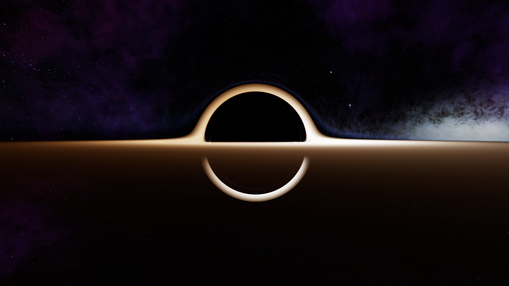

# Gargantua

## Screenshot

## Main Implementation
- Rendering pipeline: use an OpenGL 4.3 compute shader for screen-space ray tracing, write into an RGBA32F texture, and draw it with a fullscreen triangle/quad.
- Ray integration: in `shader/geodesic.comp`, build camera rays, convert to spherical coordinates, and RK4-integrate null geodesics in the Schwarzschild metric (`geodesicRHS` + `rk4Step`).
- Termination: stop rays using the capture radius, escape radius, and event horizon (`CAPTURE_R`, `ESCAPE_R`, `rs`); rays that escape sample the skybox.
- Accretion disk shading: model a thin disk with a radial temperature profile, apply gravitational redshift and Doppler factor to get observed temperature, convert to linear RGB, then absorb/accumulate (alpha accumulation).
- Tone mapping: apply ACES tone mapping to fit HDR results into display range.
- Data flow: `src/main.cpp` uploads camera pose, disk parameters, and object data via UBOs; the camera orbits a fixed black hole center.
- Interaction/perf: downscale compute resolution while the camera moves (`moving` flag) to keep interaction responsive.
- Background/assets: sample the cubemap in `assets/skybox`, loaded at runtime relative to the executable directory.

## Key Files
- `src/main.cpp`: resource initialization, camera controls, UBO updates, and compute dispatch.
- `shader/geodesic.comp`: geodesic integration and shading logic.
- `assets/skybox`: skybox cubemap textures.

## Tunable Parameters
- In `shader/geodesic.comp`, `rs`, `D_LAMBDA`, and `steps` trade quality for performance.
